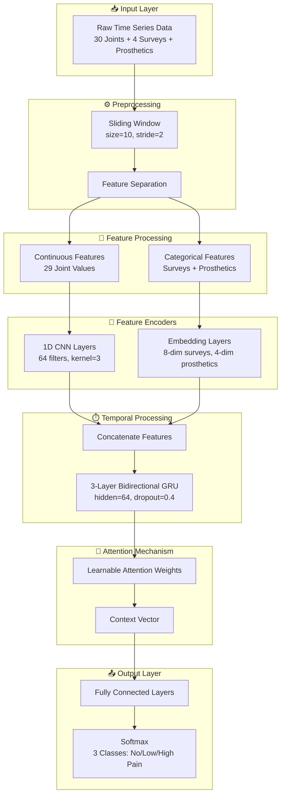

## Problem

Autonomous pain classification in time-series data requires robust temporal modeling that can capture both short-term fluctuations and long-term dependencies from 30 joint measurements and 4 pain survey responses.

## Architecture

### High-Level Overview

